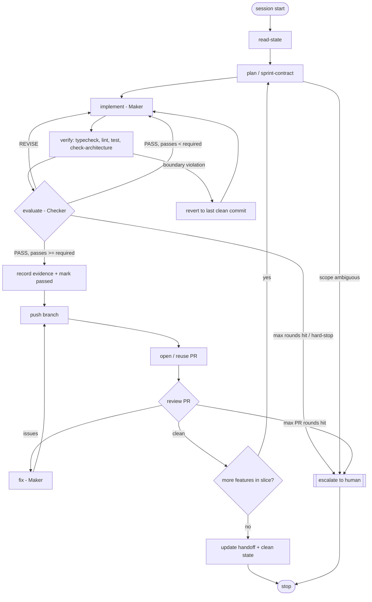

# Workflow Graph

The maker-checker loop, drawn. A graph is not a new invention here; it is what the loop becomes once it has branches, rollbacks, and a human escape hatch. This is the authoritative execution model: nodes are steps, edges are transitions, and routing rules decide the next node from shared state. `graph.json` is the machine-readable twin.

## Diagram



## Nodes
| Node | Responsibility | Input | Output | Type |
|---|---|---|---|---|
| read-state | Load handoff, feature_list, sprint contract | `.harness/state/*` | active feature + context | code (deterministic) |
| plan | Fix "done": write/confirm sprint contract | active feature, docs | signed sprint-contract | agent (Planner) |
| implement | Build the thinnest step, produce evidence | sprint contract | code + evidence | agent (Maker) |
| verify | Run checks, capture output | code | check results | code (deterministic) |
| evaluate | Score against rubric, re-run checks | code + evidence + results | score + verdict | agent (Checker) |
| record | Write evidence, set status passed | verdict PASS | updated feature_list + progress | code + agent |
| push | Push branch to origin | committed evidence | branch on remote | code (deterministic) |
| open-pr | Open PR if none exists, else reuse | branch on remote | PR number/url | code (deterministic) |
| pr-review | Review the PR diff (code-review skill) | PR | findings or clean | agent (Checker) |
| pr-fix | Address PR findings | findings | code + evidence | agent (Maker) |
| rollback | Revert to last clean commit on hard violation | dirty tree | clean tree | code (deterministic) |
| handoff | Rewrite handoff, run clean-state checklist | slice complete | clean, documented repo | agent |
| escalate | Stop and write a human-readable alert | blocker | alert in handoff | agent |

## Edges
| From | To | Type | Condition |
|---|---|---|---|
| read-state | plan | standard | always |
| plan | implement | standard | contract signed |
| plan | escalate | conditional | scope/acceptance ambiguous |
| implement | verify | standard | step complete |
| verify | evaluate | standard | checks ran |
| verify | rollback | rollback | boundary violation detected |
| rollback | implement | standard | tree clean again |
| evaluate | implement | rollback | verdict REVISE, or PASS but consecutivePasses < required |
| evaluate | record | conditional | verdict PASS and consecutivePasses >= required |
| evaluate | escalate | conditional | max rounds hit or hard-stop |
| record | push | standard | always |
| push | open-pr | standard | always |
| open-pr | pr-review | standard | always |
| pr-review | pr-fix | conditional | findings present |
| pr-fix | push | standard | fixes committed (loop) |
| pr-review | plan | conditional | clean and more features remain in slice |
| pr-review | handoff | conditional | clean and slice complete |
| pr-review | escalate | conditional | max PR rounds hit |
| handoff | stop | standard | always |
| escalate | stop | standard | always |

## Shared state (every node reads/writes this)
```
activeFeatureId        # from ROADMAP.md
sprintContract         # the signed contract for the active feature
codeChanges            # what the Maker produced this round
verifyResults          # typecheck/lint/test/check-architecture output
evaluatorVerdict       # PASS | REVISE
evaluatorScore         # avg + per-criterion
consecutivePasses      # counter toward REQUIRED_PASSES
round                  # current round; guarded by MAX_ROUNDS
standingDefects        # open defects from the Checker
prRound                # current PR review round; guarded by MAX_PR_ROUNDS
prFindings             # open findings from the last PR review
prVerdict              # CLEAN | ISSUES
```
Concrete values live across `ROADMAP.md`, `verification/sprint-contract.md`, `loops/loop-state.md`, and `loops/pr-review-loop.md`. The graph does not add a new store; it names the fields those files already hold.

## Routing rules (plain if-then, the execution logic)
```
if verify detects boundary violation      -> rollback
if verify passed                          -> evaluate
if evaluate == REVISE                     -> implement (round++)
if evaluate == PASS and passes <  required -> implement (round++)
if evaluate == PASS and passes >= required -> record
if record                                 -> push -> open-pr -> pr-review
if pr-review finds findings               -> pr-fix -> push (prRound++)
if pr-review clean and more features left -> plan (next feature)
if pr-review clean and slice complete     -> handoff
if round >= MAX_ROUNDS or hard-stop       -> escalate
if prRound >= MAX_PR_ROUNDS               -> escalate
if plan finds scope ambiguous             -> escalate
```

## Why draw it
Two payoffs. First, the branches (rollback on violation, escalate on max-rounds, the consecutive-pass gate) are explicit instead of buried in an agent's judgment, so the loop behaves the same every run. Second, it is the seed of real graph-runner orchestration later (LangGraph-style) if you automate beyond a single agent: these nodes and edges map straight onto it.
